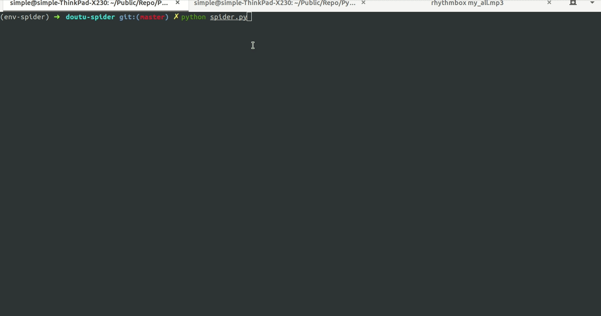

# 项目介绍
爬取《斗图啦》最新表情分类下首页图片,并保存到本地

主页：https://www.doutula.com/

爬虫入口：https://www.doutula.com/photo/list/

## 使用技术
1. urllib 发起请求
2. bs4 解析html页面
3. chardet 检测页面编码格式
4. os 文件目录操作
5. logging 日志处理
6. colorama 美化输出
6. 单线程

## 项目截图

